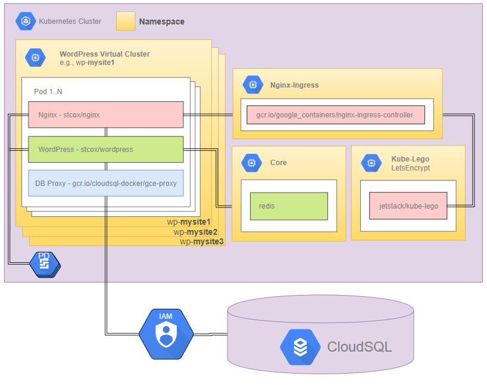

# Kubernetes WordPress
**Kubernetes WordPress** is a set of Kubernetes [Helm]((https://helm.sh/)) Charts that enables anyone to deploy multiple, scalable WordPress sites as LEMP Pods within a Kubernetes cluster. It's built to be secure and very fast by default.

Kubernetes WordPress supports:
- [Google Kubernetes Engine](https://cloud.google.com/kubernetes-engine/docs/quickstart "Google Kubernetes Engine") for container orchestration.
- [Google Compute Engine](https://cloud.google.com/compute/ "Google Compute Engine")
- [Google Cloud SQL](https://cloud.google.com/sql/docs/mysql/quickstart "Google Cloud SQL") for database services.
- [Helm, the Kubernetes Package Manager](https://helm.sh/)

Other providers haven't been tested (things like `PersistentVolume` and `Ingress` depend on your cloud provider).

Use as your own personal web server farm! Use it as a backend to your own cloud hosting company! We're moving towards extra customization in terms of web server and security hardening measures.

## How It Works
* **WordPress**
  * Each WordPress installation is based on the [wordpress:php7.2-fpm](https://hub.docker.com/r/_/wordpress/ "Official WordPress Docker image") image with extra required PHP extensions such as `redis`. WordPress is contained in one `Deployment` controller along with an NGINX container with FastCGI caching and the NAXSI web application firewall.
  * Each WordPress `Deployment` gets it's own `PersistentVolume` as well as `Secret` objects for storing sensitive information such as passwords for their DBs.
  * `ConfigMap`s are used to inject various `php.ini` settings for PHP 7.2.

* **NGINX**
  * The NGINX container has multiple handy configurations for multi-site and caching, all easily deployed using `ConfigMap` objects.
  * NGINX is built with an optimized [`nginx`](https://github.com/stcox/nginx) image, which comes with:
    * NBS System's [NAXSI module](https://github.com/nbs-system/naxsi). NAXSI means [NGINX](http://nginx.org/) Anti-[XSS](https://www.owasp.org/index.php/Cross-site_Scripting_%28XSS%29) & [SQL Injection](https://www.owasp.org/index.php/SQL_injection).
    * Handy configurations for NGINX and the NAXSI web application firewall are also included via `ConfigMap`s.

* **Cloud SQL**
  * Initially, the WordPress pods all interface with one [Google Cloud SQL](https://cloud.google.com/sql/) database server. This is so anyone can start off with a full-fledged web farm and bring up any number of websites using a Cloud SQL server instance with a database for each site.

* **Redis**
  * To reduce hits to the DB we build the WP image with the `redis` PHP extension and include a Redis `Deployment`.
  * WP must be configured to use Redis upon initialising a new WP site by installing and configuring the WP [Redis Object Cache](https://wordpress.org/plugins/redis-cache/ "Redis Object Cache plugin for WordPress") plugin.

* **Ingress/Kube Lego**
  * Websites are reached externally via an `nginx` `Ingress` controller. See Kubernetes documentation regarding `Ingress` in the [official docs](https://kubernetes.io/docs/user-guide/ingress/ "Ingress Resources") and on [GitHub](https://github.com/kubernetes/ingress/blob/master/controllers/nginx/README.md "NGINX Ingress Controller").
  * All TLS is terminated at `Ingress` via free Let's Encrypt certificates good for all domains on your cluster. Better yet, certificate issuance is handled automatically with the awesome [Kube Lego](https://github.com/jetstack/kube-lego "Kube Lego").

* See [**Installation and Usage**](USAGE.md) for instructions on getting up and running.

## TODO
- Upgrade kube-lego to cert-manager

## Installation and Usage
Visit [USAGE.md](USAGE.md "Installation & Usage").

## Acknowledgements
This project was inspired by and based on [daxio/k8s-lemp](https://github.com/daxio/k8s-lemp "Kubernetes LEMP Stack") and builds on it with the various other official Docker images and Kubernetes applications mentioned previously.
